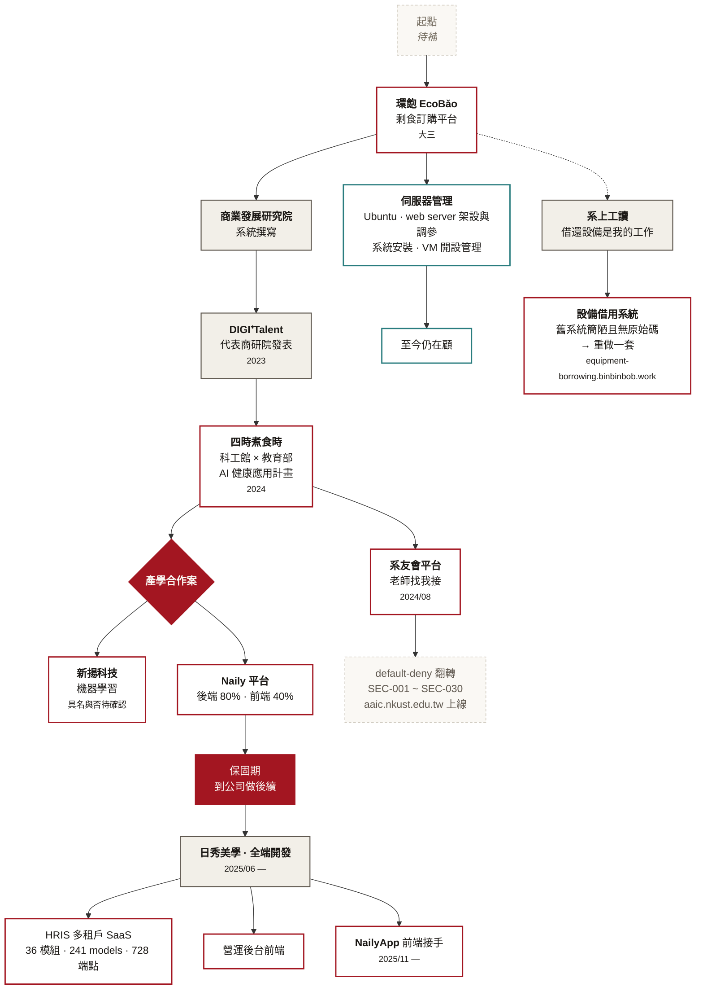

# 經歷流程圖

> 依 2026-09-12 使用者口述補充重繪。這張圖同時是 `/about` 的敘事骨架,
> 也是「投影布」改版裡預計佔一整張投影片的主視覺。

## 這張圖修正了什麼

- 舊敘事把 Naily 寫成「接手別人的 codebase」。實際上它是**產學合作案**,
  後端 80%、前端 40% 是你寫的,**保固**才是通往正職的那條邊;
  **NailyApp 是進公司之後(2025/11)才接的**,跟平台是兩件事。
- **伺服器管理**是一條從大三延續至今、站上完全沒出現過的線,圖裡用另一個顏色獨立畫出來。
- **設備借用系統**的來源是你自己的工讀經驗,不是被指派的題目——圖上用虛線把它接回 EcoBǎo 時期。
- 兩個產學案是同一個節點分岔,不是先後關係。
